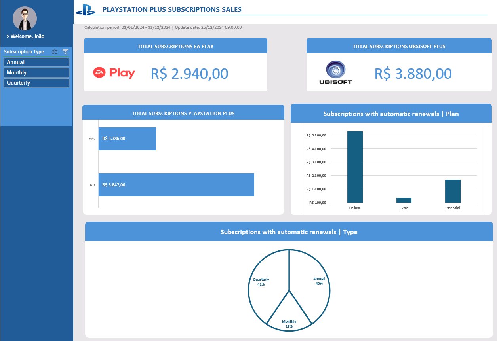
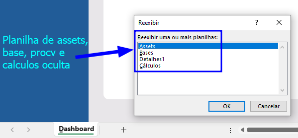
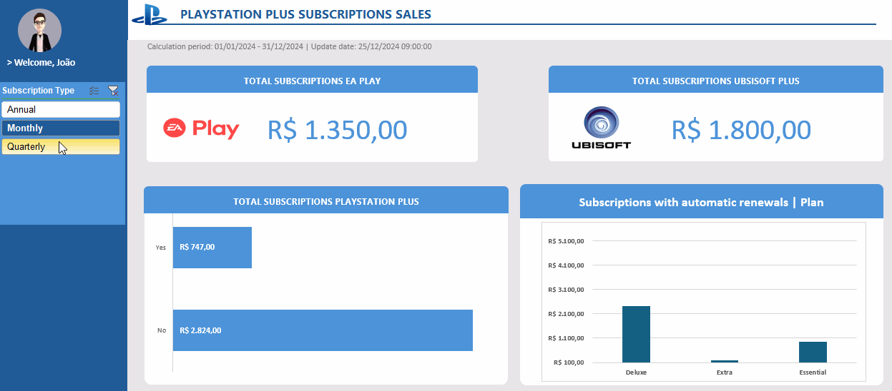

  

# Reposítório criado para registro e entrega de projeto para o curso "Criando um dashboard de vendas do XBOX com Excel"
## ÍNDICE
 <a href="#section1" style="text-decoration:none;">**1.** 📊 Apresentação de ferramenta criada</a>

 <a href="#section2" style="text-decoration:none;">**2.** ⚙ Recursos e funcionalidades disponíveis</a>

 <a href="#section3" style="text-decoration:none;">**3.** ⏯️ Curso que motivou a criação do repositório</a>

 <a href="#section4" style="text-decoration:none;">**4.**  Autor | Menções honrosas</a>

 

## 
 1. 📊 Apresentação de ferramenta criada

 

## 
 2. ⚙ Recursos e automações disponíveis
- **Assets, cálculos e bases ocultas (disponível em abas/planilhas que podem ser reexibidas para serem tratadas ou atualizadas se necessário)**

- **Gráficos atualizando em tempo real de acordo com filtro**

 

## 
 3. ⏯️ Curso que motivou a criação do repositório
- **🏆 DioBootCamp [Excel com Inteligência Artificial](https://web.dio.me/track/santander-excel-com-inteligencia-artificial)**
  - BootCamp oferecido em parceria entre a plataforma dio e o [SantanderAcademy](https://app.santanderopenacademy.com/pt-BR/program/excel-com-inteligencia-artificial).

 

## 
 4.  Autor

|  [ Pedro Guedes](https://github.com/pedroaugustorgg) |
| :---: |

## 🧾 Menções honrosas - Fontes de inspiração

 - **📋 [EstudoGit](https://github.com/pedroaugustorgg/EstudoGit):**  Modelo inspirado de documentação
 - **🟢 [Planilha de Vendas XBOX](https://web.dio.me/project/criando-um-dashboard-de-vendas-do-xbox/):** Modelo de planilha apresentado e disponibilizado durante o curso de dashboard de vendas em Excel da plataforma Dio.
